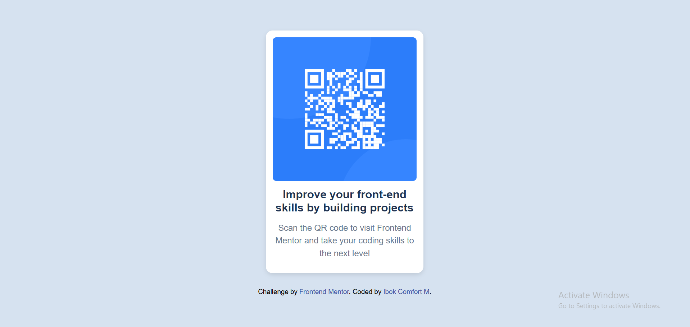

# Frontend Mentor - QR Code Component

This is a responsive and accessible QR Code component built with HTML and CSS. It was developed as part of a Frontend Mentor challenge to improve front-end skills through hands-on projects.

## Project Overview

### Screenshot



This screenshot shows my completed QR code component, designed to be responsive and visually aligned with the Frontend Mentor style guide.

### Links

- Live Site URL:
- Design Source: [Frontend Mentor](https://www.frontendmentor.io/challenges/qr-code-component-iux_sIO_H)

### Tools Used

- HTML5
- CSS3
- Google Fonts (Outfit)

### Features

- Responsive layout with media queries
- Accessible markup with semantic HTML5 markup and ARIA labels
- Clean and modern design using HSL color palette
- Font styling with Google Fonts

### What I learned

- Centering elements perfectly using Flexbox.
- Writing clean, scalable CSS with media queries for small screens.
- Applying hover and focus states to improve interactivity and usability.

Here’s a snippet I’m proud of:

```css
main {
  width: 95%;
  margin: 0 auto;
  min-height: 100vh;
  display: flex;
  flex-direction: column;
  justify-content: center;
  align-items: center;
}
```

### Continued development

- Explore CSS Grid for more complex layouts.
- Practice improving color contrast.

### Useful resources

MDN Web Docs – Flexbox

- Excellent guide to understanding responsive layouts.

##e Setup Instructions

1. Clone the repository:

   ```
   git clone https://github.com/comfortibok/
   ```

2. Navigate to the folder:

   ```
   cd qr_code_component
   ```

3. Open with Live Server by right clicking on index.html

## Author

- Github - [Comfort Ibok](https://github.com/comfortibok/)
- Frontend Mentor - [Comfort Ibok](https://www.frontendmentor.io/profile/comfortibok)

